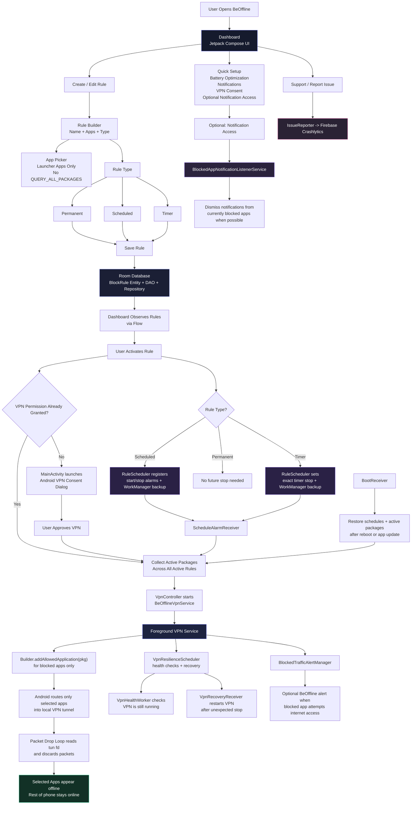

# BeOffline Technical Flow Diagram

This diagram is designed to be shareable and easy to explain in a post, while still staying faithful to how the app actually works.

## Suggested framing for LinkedIn

- Problem: most focus tools mute noise, but the app still stays connected.
- Core idea: BeOffline uses Android's local VPN framework to make selected apps truly offline.
- Technical angle: Compose UI + Room + Hilt + WorkManager + AlarmManager + VpnService + optional NotificationListenerService.
- Reliability angle: scheduled recovery, boot restore, health monitoring, and background protection guidance.
